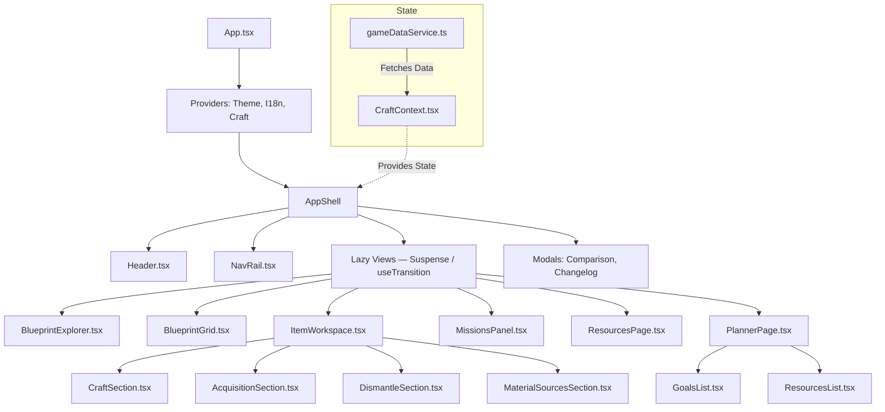

# Item Fabricator

**[itemfab.space](https://itemfab.space)**

React + TypeScript app for Star Citizen crafting, dismantling analysis, mission reward browsing, and resource planning.

## Features

- **Blueprint Library** — search, segmented control (All / Inventory / Favorites / Obtainable), category accordions, manufacturer / legality / rarity / slot / craft-time filters. Compact cards with item thumbnails, manufacturer logos, and category icon fallbacks.
- **Item Workspace** — two-column layout: identity + acquisition left (sticky), craft simulator + material sources + dismantling right (scrollable).
- **Craft Simulator** — slot quality picker with +/− controls, per-category stat panel (weapons / armor / magazines), GPP modifier sparkline, stat impact radar, material resource summary.
- **Acquisition Sources** — per-blueprint mission contracts with employer, faction, standing, location, and availability scale.
- **Dismantling** — contextual dismantling metadata (efficiency, queues, global parameters).
- **Mission Directory** — faction accordions, contract cards, filters by location / scale / standing / text search. Blueprint reward chips navigate to the Item Workspace.
- **Resources** — resource card grid with filters (family, source type, system, mission demand, blueprint category) and an inline detail panel (identity, best sources, mission demand, blueprint usage).
- **Planner** — full-page crafting plan: goal list with quality assignments, aggregated resources with per-resource method selector (Mission / Mining / Dismantle / Buy), SCU slider, mission contract accordion, copy text / JSON export.
- **NavRail** — 4-item side rail (Blueprints / Missions / Resources / Planner). Desktop: collapsible 200 px / 64 px. Mobile: 4-column tab bar.
- **Comparison** — side-by-side stat comparison for up to 4 blueprints with color-coded deltas.
- **Dataset Changelog** — PTU vs LIVE diff accessible via the header Δ button.
- **External Media** — blueprint images and manufacturer logos resolved from starcitizen.tools wiki.

## Architecture

### Component Map



Production data is runtime-driven:

1. Game files are copied locally for extraction.
2. Exporter scripts normalize and chunk data.
3. Chunks are published to Cloudflare R2 (`sc-craft-game-data` for prod, `sc-craft-game-data-dev` for local/dev).
4. Cloudflare Pages Functions read chunks from R2 at runtime via the `GAME_DATA` binding.
5. The browser fetches `/api/game-data/public*`.
6. Account auth, when configured, flows through `/api/auth/*` with Discord OAuth 2 and a signed HttpOnly session cookie.

Production URL: [itemfab.space](https://itemfab.space) (Cloudflare Pages + custom domain)

### R2 storage layout

```
indexes/public.json                                                ← published datasets index
indexes/all.json                                                   ← all datasets index (dev/preview)
datasets/{datasetId}/core.json                                     ← blueprint catalog + resources + metadata
datasets/{datasetId}/resource-data.json                            ← resourceInsights + materialSources
datasets/{datasetId}/ship-components.json                          ← shipComponents
datasets/{datasetId}/mission-rewards.json                          ← slim missionRewards (no contracts, +blueprintAcquisitionGraph)
datasets/{datasetId}/mission-rewards/factions/{factionId}.json     ← per-faction contracts (lazy-loaded)
datasets/{datasetId}/changelog.json                                ← PTU vs LIVE diff
datasets/{datasetId}/blueprints/{id}.json                          ← full blueprint detail
aliases/public/{channel}/core.json                                 ← latest published dataset for channel (mutable)
aliases/public/{channel}/resource-data.json
aliases/public/{channel}/mission-rewards.json
aliases/public/{channel}/mission-rewards/factions/{factionId}.json ← per-faction contracts alias (mutable)
aliases/public/{channel}/...
aliases/all/{channel}/...                                          ← same for dev/preview
```

### Runtime endpoints

```
GET /api/game-data/public                                                    → dataset index
GET /api/game-data/public/:channel                                           → core (catalog blueprints + resources)
GET /api/game-data/public/:channel/resource-data                             → resourceInsights + materialSources
GET /api/game-data/public/:channel/ship-components                           → shipComponents
GET /api/game-data/public/:channel/mission-rewards                           → slim missionRewards (no contracts)
GET /api/game-data/public/:channel/mission-rewards/factions/:factionId       → per-faction contracts
GET /api/game-data/public/:channel/changelog                                 → PTU vs LIVE diff
GET /api/game-data/public/by-id/:datasetId                                   → core by exact datasetId
GET /api/game-data/public/by-id/:datasetId/resource-data
GET /api/game-data/public/by-id/:datasetId/ship-components
GET /api/game-data/public/by-id/:datasetId/mission-rewards
GET /api/game-data/public/by-id/:datasetId/mission-rewards/factions/:factionId → per-faction contracts by datasetId
GET /api/game-data/public/by-id/:datasetId/changelog
GET /api/game-data/public/by-id/:datasetId/blueprints/:id                   → full blueprint detail
GET /api/auth/session                                                        → current auth session (`enabled`, provider, user)
GET /api/auth/discord/login?returnTo=/path                                   → start Discord OAuth 2 redirect
GET /api/auth/discord/callback                                               → Discord OAuth 2 callback, sets signed session cookie
POST /api/auth/logout                                                        → clear auth session cookies
```

### Auth foundation

Current account/auth scope:

- Provider: Discord OAuth 2
- Default scope: `identify`
- Session storage: signed stateless HttpOnly cookie (`sc_craft_session`)
- CSRF protection: signed short-lived OAuth state cookie (`sc_craft_discord_oauth_state`)
- Stored identity: Discord profile only for now, no local account database yet
- Discord access tokens are exchanged server-side and discarded after `/users/@me`

## Discord Bot Worker

A dedicated Discord bot Worker scaffold is available in [`workers/discord-bot`](./workers/discord-bot).

- Runtime: separate Cloudflare Worker
- Commands included: `/ping`, `/open`, `/dataset`, `/help`
- Local dev: `npm run discord:bot:dev`
- Registration: `npm run discord:bot:register:guild` or `npm run discord:bot:register:global`
- Deploy: `npm run discord:bot:deploy`

## Quick Start

### Prerequisites

- Node.js 24+
- Cloudflare R2 credentials (see Local dev section)
- Copied Star Citizen game files in `exporter/source-game-files/PTU` or `exporter/source-game-files/LIVE` (only needed for re-extraction)

### Install

```bash
npm install
```

### Local dev

Create a root `.dev.vars` file (never commit — already in `.gitignore`):

```bash
R2_ACCOUNT_ID=<cloudflare-account-id>
R2_ACCESS_KEY_ID=<r2-access-key-id>
R2_SECRET_ACCESS_KEY=<r2-secret-access-key>
R2_BUCKET_NAME=sc-craft-game-data-dev
R2_BUCKET_REGION=auto

# Optional Discord OAuth 2 foundation
# Register http://localhost:5173/api/auth/discord/callback in the Discord developer portal.
DISCORD_CLIENT_ID=<discord-client-id>
DISCORD_CLIENT_SECRET=<discord-client-secret>
AUTH_SESSION_SECRET=<long-random-secret>
AUTH_PUBLIC_ORIGIN=http://localhost:5173
```

Then run:

```bash
npm run dev
```

This starts two processes in parallel:

- Vite on `http://localhost:5173`
- `scripts/devApiServer.mjs` on `http://127.0.0.1:8788` — a plain Node HTTP server that serves all `/api/game-data/public*` routes by reading chunks directly from the dev R2 bucket declared in `.dev.vars` via `@aws-sdk/client-s3`

If Discord auth is enabled locally, keep `AUTH_PUBLIC_ORIGIN=http://localhost:5173` so the OAuth callback returns to the frontend host and Vite proxies `/api/auth/*` back to the local API server. Otherwise the session cookie lands on the wrong host (`127.0.0.1` vs `localhost`).

### Build

```bash
npm run build
```

### Deploy

```bash
npm run deploy
```

This builds the client and deploys `client/dist` to Cloudflare Pages.

## Game Data Rules

These rules are important when changing the app or the exporter.

### Crafting

- Each crafting slot resolves to one fixed required material.
- `minQuality` is a raw numeric threshold from game data.
- Material quality is a numeric stack value on a `0-1000` scale.
- Do not model quality as source-of-truth tiers like `CMS`, `CMP`, `CMR`, `chunks`, `scraps`, or `powder`.

### Dismantling

- The dataset proves one global dismantle process.
- Dismantling metadata such as efficiency, time, queues, and default composition quality must come from extracted game files.
- The current extraction does not prove a complete per-item dismantle yield table.
- `dismantling.perItemYieldModel.resolved` must remain authoritative.

### Mission rewards

- Mission giver / faction grouping comes from extracted contract data.
- Reputation scopes, minimum standings, and availability scale come from extracted mission records.
- Current PTU 4.7 extraction proves blueprint reward contracts.
- Current PTU 4.7 extraction does not prove explicit craft-resource reward contracts in contract XML.

Detailed reference: [CRAFTING_AND_DISMANTLING_MECHANICS.md](./CRAFTING_AND_DISMANTLING_MECHANICS.md)

## Extraction Pipeline

The extractor works from copied game files only. It must not touch a live game installation.

### Required copied files

Place a copied dataset under `exporter/source-game-files/PTU` or `exporter/source-game-files/LIVE`:

- `Data.p4k` required
- `build_manifest.id` recommended
- `Game.log` optional fallback

### Main extraction command

```powershell
powershell -ExecutionPolicy Bypass -File .\exporter\extract-game-data.ps1 -SourcePath .\exporter\source-game-files\PTU
```

The script detects channel, version, build number, and output label, then runs:

1. blueprint extraction
2. localization and item stat extraction
3. mission reward extraction
4. dismantling extraction
5. material sources extraction
6. resource image extraction
7. optional R2 publication prompt

### Main exported files

- `exporter/output/<label>-crafting-blueprints.json`
- `exporter/output/<label>-localizations.json`
- `exporter/output/<label>-item-stats.json`
- `exporter/output/<label>-mission-rewards.json`
- `exporter/output/<label>-dismantling.json`
- `exporter/output/<label>-material-sources.json`
- `exporter/output/<label>-resource-images.json`
- `exporter/output/<label>-build-manifest.json`

### Publish to R2

The normal path is to publish from the extractor prompt. You can also import manually to production. `npm run import:*` reads `exporter/.env`, which should target the prod bucket `sc-craft-game-data`:

```bash
npm run import:ptu
npm run import:live
```

For flags such as `published=true`, call the Node entrypoint directly:

```bash
node ./exporter/importToR2.mjs --channel=live --published=true
```

To publish to the dev bucket used by `npm run dev:api`, use the dedicated dev importer. It reads the root `.dev.vars` file and refuses to run unless `R2_BUCKET_NAME` ends with `-dev`.

```bash
npm run import:ptu:dev
npm run import:live:dev
```

You can also call the wrapper directly:

```bash
node ./exporter/importToR2_dev.mjs --channel=live --published=true
```

## Scripts

| Command | Description |
| --- | --- |
| `npm run dev` | Vite dev server plus local R2 API server |
| `npm run build` | Type-check and build the client |
| `npm run deploy` | Build the client and deploy to Cloudflare Pages |
| `npm run import:ptu` | Import the PTU dataset into R2 |
| `npm run import:live` | Import the LIVE dataset into R2 |
| `npm run import:ptu:dev` | Import the PTU dataset into the dev R2 bucket from `.dev.vars` |
| `npm run import:live:dev` | Import the LIVE dataset into the dev R2 bucket from `.dev.vars` |

## Key Files

| File | Purpose |
| --- | --- |
| `client/src/App.tsx` | root shell — lazy views, Suspense/useTransition, view routing |
| `client/src/store/CraftContext.tsx` | central frontend state and dataset loading |
| `client/src/services/gameDataService.ts` | runtime fetch client (all chunk loaders) |
| `client/src/components/NavRail.tsx` | side nav (Blueprints / Missions / Resources / Planner) |
| `client/src/components/Header.tsx` | top bar |
| `client/src/components/BlueprintExplorer.tsx` | blueprint library sidebar (search, filters, sort) |
| `client/src/components/BlueprintGrid.tsx` | responsive blueprint card grid |
| `client/src/components/ItemWorkspace.tsx` | two-column item detail view |
| `client/src/components/item-workspace/CraftSection.tsx` | craft simulator |
| `client/src/components/MissionsPanel.tsx` | mission directory (faction accordions, contract cards, filters) |
| `client/src/components/ResourcesPage.tsx` | resource explorer (card grid + detail panel) |
| `client/src/components/PlannerPage.tsx` | full-page planner (goals + resource tracking) |
| `client/src/components/planner/` | planner sub-components (GoalsList, ResourcesList, ResourceRow, …) |
| `client/src/components/item-workspace/` | item workspace sub-components |
| `functions/_shared/r2Store.js` | raw R2 access via GAME_DATA binding + caches.default |
| `functions/_shared/r2Datasets.js` | higher-level R2 helpers (index, channel alias, by-id with visibility) |
| `functions/_shared/gameData.js` | response helpers, visibility logic, isValidChannel |
| `functions/api/game-data/public.js` | dataset index endpoint |
| `functions/api/game-data/public/[channel].js` | core dataset endpoint |
| `functions/api/game-data/public/[channel]/mission-rewards.js` | slim mission rewards endpoint |
| `functions/api/game-data/public/[channel]/mission-rewards/factions/[factionId].js` | per-faction contracts endpoint (channel alias) |
| `functions/api/game-data/public/by-id/[datasetId]/mission-rewards/factions/[factionId].js` | per-faction contracts endpoint (by datasetId) |
| `scripts/devApiServer.mjs` | local API server — serves all public routes from R2 |
| `exporter/extract-game-data.ps1` | main extraction entry point |
| `exporter/dataset-builder.mjs` | normalized dataset builder |
| `exporter/dataset-chunks.mjs` | chunk split logic (core, resource-data, ship-components, mission-rewards slim + per-faction, changelog, blueprint details) |
| `exporter/importToR2.mjs` | R2 publication pipeline |
| `exporter/migrateMissionRewardsFactions.mjs` | one-time migration: writes per-faction contract objects to R2 from existing mission-rewards chunks |
| `shared/r2Storage.mjs` | S3-compatible R2 client (used by exporter + devApiServer) |
