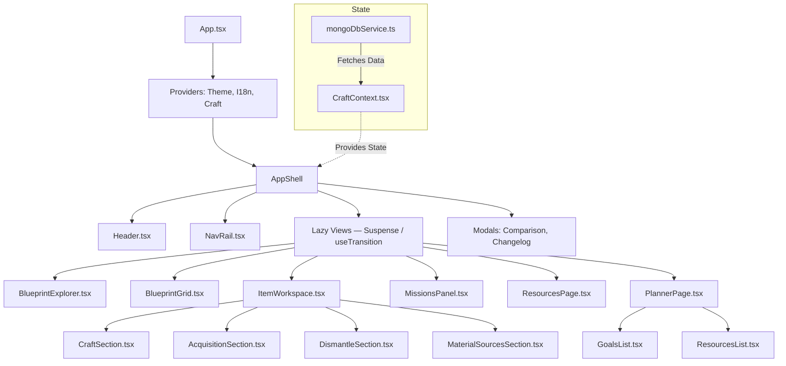

# Item Fabricator

**[itemfab.space](https://itemfab.space)**

React + TypeScript app for Star Citizen crafting, dismantling analysis, mission reward browsing, and resource planning.

## Features

- **Blueprint Library** — search, segmented control (All / Inventory / Favorites / Obtainable), category accordions, manufacturer / legality / rarity / slot / craft-time filters. Compact cards with item thumbnails, manufacturer logos, and category icon fallbacks.
- **Item Workspace** — two-column layout: identity + acquisition left (sticky), craft simulator + material sources + dismantling right (scrollable).
- **Craft Simulator** — slot quality picker with +/− controls, per-category stat panel (weapons / armor / magazines), GPP modifier sparkline, stat impact radar, material resource summary.
- **Acquisition Sources** — per-blueprint mission contracts with employer, faction, standing, location, and availability scale.
- **Dismantling** — contextual dismantling metadata (efficiency, queues, global parameters).
- **Mission Directory** — faction accordions, contract cards, filters by location / scale / standing / text search. Blueprint reward chips navigate to the Item Workspace.
- **Resources** — resource card grid with filters (family, source type, system, mission demand, blueprint category) and an inline detail panel (identity, best sources, mission demand, blueprint usage).
- **Planner** — full-page crafting plan: goal list with quality assignments, aggregated resources with per-resource method selector (Mission / Mining / Dismantle / Buy), SCU slider, mission contract accordion, copy text / JSON export.
- **NavRail** — 4-item side rail (Blueprints / Missions / Resources / Planner). Desktop: collapsible 200 px / 64 px. Mobile: 4-column tab bar.
- **Comparison** — side-by-side stat comparison for up to 4 blueprints with color-coded deltas.
- **Dataset Changelog** — PTU vs LIVE diff accessible via the header Δ button.
- **External Media** — blueprint images and manufacturer logos resolved from starcitizen.tools wiki.

## Architecture

### Component Map



Production data is runtime-driven:

- Browser
- Cloudflare Pages Functions
- MongoDB Atlas

The frontend must not read or generate local dataset snapshots. The published MongoDB dataset is the source of truth.

Production URL: [itemfab.space](https://itemfab.space) (Cloudflare Pages + custom domain)

Runtime endpoints:

- `GET /api/game-data/public`
- `GET /api/game-data/public/:channel`
- `GET /api/game-data/public/:channel/mission-rewards`

`missionRewards` is loaded lazily (separate endpoint, heaviest block).

## Quick Start

### Prerequisites

- Node.js 22+
- a published dataset in MongoDB Atlas
- copied Star Citizen files in `exporter/source-game-files/PTU` or `exporter/source-game-files/LIVE` only if you want to re-extract data

### Install

```bash
npm install
```

### Local dev

Create a root `.dev.vars` file for Cloudflare Pages local functions:

```bash
MONGODB_URI=mongodb+srv://<user>:<password>@<cluster>.mongodb.net/?appName=<AppName>
```

Then run:

```bash
npm run dev
```

This starts:

- Vite on `http://localhost:5173`
- a local Node API server on `http://127.0.0.1:8788`

Use `http://localhost:5173` as the dev app URL. The client proxies `/api/*` to the local Mongo-backed API server.

### Build

```bash
npm run build
```

### Deploy

```bash
npm run deploy
```

This builds the client and deploys `client/dist` to Cloudflare Pages.

CI also runs `node scripts/patchMongoTls.mjs` before the build. This patches the MongoDB driver to use a `cloudflare:sockets` TLS shim (`functions/_shared/tls-cf-shim.js`) instead of the `node:tls` polyfill, which hangs against MongoDB Atlas in Workers.

## Game Data Rules

These rules are important when changing the app or the exporter.

### Crafting

- Each crafting slot resolves to one fixed required material.
- `minQuality` is a raw numeric threshold from game data.
- Material quality is a numeric stack value on a `0-1000` scale.
- Do not model quality as source-of-truth tiers like `CMS`, `CMP`, `CMR`, `chunks`, `scraps`, or `powder`.

### Dismantling

- The dataset proves one global dismantle process.
- Dismantling metadata such as efficiency, time, queues, and default composition quality must come from extracted game files.
- The current extraction does not prove a complete per-item dismantle yield table.
- `dismantling.perItemYieldModel.resolved` must remain authoritative.

### Mission rewards

- Mission giver / faction grouping comes from extracted contract data.
- Reputation scopes, minimum standings, and availability scale come from extracted mission records.
- Current PTU 4.7 extraction proves blueprint reward contracts.
- Current PTU 4.7 extraction does not prove explicit craft-resource reward contracts in contract XML.

Detailed reference: [CRAFTING_AND_DISMANTLING_MECHANICS.md](./CRAFTING_AND_DISMANTLING_MECHANICS.md)

## Extraction Pipeline

The extractor works from copied game files only. It must not touch a live game installation.

### Required copied files

Place a copied dataset under `exporter/source-game-files/PTU` or `exporter/source-game-files/LIVE`:

- `Data.p4k` required
- `build_manifest.id` recommended
- `Game.log` optional fallback

### Main extraction command

```powershell
powershell -ExecutionPolicy Bypass -File .\exporter\extract-game-data.ps1 -SourcePath .\exporter\source-game-files\PTU
```

The script detects channel, version, build number, and output label, then runs:

1. blueprint extraction
2. localization and item stat extraction
3. mission reward extraction
4. dismantling extraction
5. material sources extraction
6. resource image extraction
7. optional MongoDB publication prompt

### Main exported files

- `exporter/output/<label>-crafting-blueprints.json`
- `exporter/output/<label>-localizations.json`
- `exporter/output/<label>-item-stats.json`
- `exporter/output/<label>-mission-rewards.json`
- `exporter/output/<label>-dismantling.json`
- `exporter/output/<label>-material-sources.json`
- `exporter/output/<label>-resource-images.json`

### Publish to MongoDB

The normal path is to publish from the extractor prompt. You can also import manually:

```bash
npm run import:ptu
npm run import:live
```

## App Data Contract

### Dataset index

`GET /api/game-data/public` returns lightweight summaries per channel.

### Core dataset

`GET /api/game-data/public/:channel` returns `resources`, `blueprints`, `dismantling`, `changelog`, `materialSources`, optional `resourceInsights`, and dataset metadata.

### Mission rewards dataset

`GET /api/game-data/public/:channel/mission-rewards` returns `summary`, `conclusions`, and `factionGroups`.

## Scripts

| Command | Description |
| --- | --- |
| `npm run dev` | Vite dev server plus Cloudflare Pages local proxy |
| `npm run build` | Type-check and build the client |
| `npm run deploy` | Build the client and deploy to Cloudflare Pages |
| `npm run import:ptu` | Import the PTU dataset into MongoDB |
| `npm run import:live` | Import the LIVE dataset into MongoDB |

## Key Files

| File | Purpose |
| --- | --- |
| `client/src/App.tsx` | root shell — lazy views, Suspense/useTransition, view routing |
| `client/src/store/CraftContext.tsx` | central frontend state and dataset loading |
| `client/src/services/mongoDbService.ts` | runtime fetch client for published datasets |
| `client/src/components/NavRail.tsx` | side nav (Blueprints / Missions / Resources / Planner) |
| `client/src/components/Header.tsx` | top bar |
| `client/src/components/BlueprintExplorer.tsx` | blueprint library sidebar (search, filters, sort) |
| `client/src/components/BlueprintGrid.tsx` | responsive blueprint card grid |
| `client/src/components/ItemWorkspace.tsx` | two-column item detail view |
| `client/src/components/item-workspace/CraftSection.tsx` | craft simulator |
| `client/src/components/MissionsPanel.tsx` | mission directory (faction accordions, contract cards, filters) |
| `client/src/components/ResourcesPage.tsx` | resource explorer (card grid + detail panel) |
| `client/src/components/PlannerPage.tsx` | full-page planner (goals + resource tracking) |
| `client/src/components/planner/` | planner sub-components (GoalsList, ResourcesList, ResourceRow, …) |
| `client/src/components/item-workspace/` | item workspace sub-components |
| `functions/_shared/mongoClient.js` | Cloudflare Pages MongoDB client |
| `functions/_shared/tls-cf-shim.js` | cloudflare:sockets TLS shim — replaces node:tls for MongoDB in Workers |
| `functions/api/game-data/public.js` | dataset index endpoint |
| `functions/api/game-data/public/[channel].js` | core dataset endpoint |
| `functions/api/game-data/public/[channel]/mission-rewards.js` | mission rewards endpoint |
| `scripts/patchMongoTls.mjs` | CI script — patches MongoDB driver to use tls-cf-shim.js |
| `exporter/extract-game-data.ps1` | main extraction entry point |
| `exporter/dataset-builder.mjs` | normalized dataset builder |
| `exporter/importToMongo.mjs` | Atlas import pipeline |
